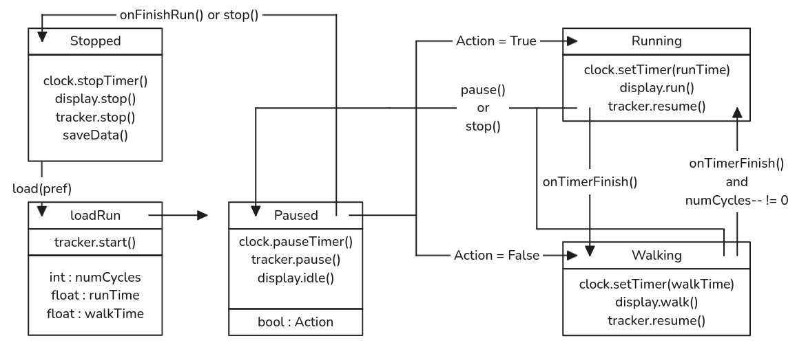

# Running App, real name TBA

## TODO

### MVP

- [x] basic stopwatch
> Timer class 
> 
> setTimer(seconds) declares # of seconds on timer.
> 
> can also start, stop, and pause

- [ ] method of controlling countdown states / times
> Should be able to read in the default pref, and start timers of set length and update the stateDisplay for the appropriate action.
> 
> currently is hardcoded, but adding actually loading shouldn't be too hard, probably

- [ ] distance tracking (can currently get lat / long)
> using gms can request lat / long, want to tie into a google map to show running route

- [x] way to save and load data
> saveFloats(saveKey, floatList, keyList) will save to shared preferences a list of floats
> with keys under a preference named saveKey

- [ ] run planner / editor
> should be able to save to a preference using saveFloats, number of cycles and run / walk time can all be floats
> for now should just load and save to a pref using default as a key, add more functionality later

- [ ] basic ui to tell user to run / walk
> Improve stateDisplay class to include some kind of visual other than simple text output
> using run() and walk()

### Final App

- [ ] more advanced ui
- [ ] allow more than one saved run
- [ ] Tracking of stats
- [ ] notification system / running app in background
- [ ] use google maps api to show active location
- [ ] make it look presentable

### Stretch Goals

- [ ] make it look good